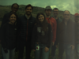

<!DOCTYPE html>
<html lang="en">
  <head>
    <meta charset="UTF-8" />
    <title>Enrique Heredia Aguado</title>
    <link
      id="favicon"
      rel="shortcut icon"
      type="image/png"
      href="./img/robot.png"
    />
    <link rel="stylesheet" type="text/css" href="./css/index.css" />
    <link rel="stylesheet" type="text/css" href="./css/gitgraph.css" />
    <link rel="stylesheet" type="text/css" href="./css/gallery.css" />
  </head>
  <body>
    <header>
      
      
      
      <h1 style="margin-left:15.5%;"><strong>Enrique Heredia Aguado</strong>
        &nbsp;&nbsp;&nbsp;-&nbsp;&nbsp;&nbsp;Robotics Engineer
      </h1>
      
      <nav>
        <a href="index.html#" id="nav-contact">Contact</a>
        <a href="index.html#" id="nav-presentation">Presentation</a>
        <a href="index.html#" id="nav-education">Eduation</a>
        <a href="index.html#" id="nav-work">Work Experience</a>
        <a href="index.html#" id="nav-skills">Skills</a>
        <a href="gallery.html">Gallery</a>
      </nav>
    </header>
<body>
    <section>
        <!-- The grid: four columns -->
        <h1>ERGO Field tests</h1>
        

            

                
            

            

                
            

            

                
            

            

                
            

        

        
        <h1>GOTCHA Field tests</h1>
        

            

                
            

            

                
            

            

                
            

            

                
            

        

    </section>

    <!-- The expanding image container -->
    

        <!-- Close the image -->
        &times;

        <!-- Expanded image -->
        

        <!-- Image text -->
        

    

    <!-- Scripts -->
    
    
    
    
    
</body>
</html>